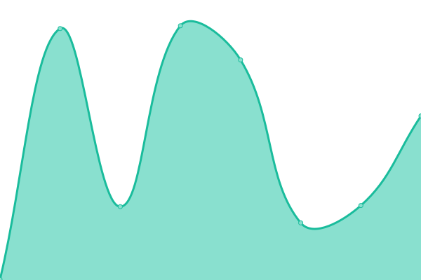
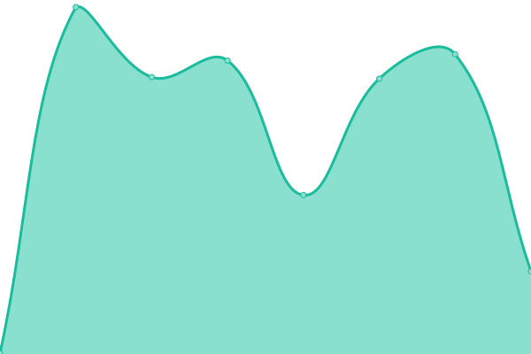
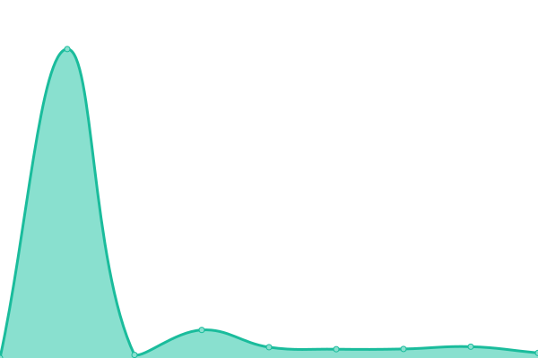

# [📈 Live Status](https://status.onedot.cf): <!--live status--> **🟩 All systems operational**

This repository contains the open-source uptime monitor and status page for [Upptime](https://upptime.js.org), powered by [Upptime](https://github.com/upptime/upptime).

    

With [Upptime](https://upptime.js.org), you can get your own unlimited and free uptime monitor and status page, powered entirely by a GitHub repository. We use [Issues](https://github.com/upptime/upptime/issues) as incident reports, [Actions](https://github.com/upptime/upptime/actions) as uptime monitors, and [Pages](https://status.onedot.cf) for the status page.

<!--start: status pages-->
<!-- This summary is generated by Upptime (https://github.com/upptime/upptime) -->
<!-- Do not edit this manually, your changes will be overwritten -->
<!-- prettier-ignore -->
| URL | Status | History | Response Time | Uptime |
| --- | ------ | ------- | ------------- | ------ |
|  [1Auth](https://auth.onedot.cf) | 🟩 Up | [1-auth.yml](https://github.com/onedotprojects/status/commits/HEAD/history/1-auth.yml) | 

 5090ms
     
 | 

<a href="https://status.onedot.cf/history/1-auth">100.00%</a>
    

|  [1CDN](https://cdn.onedot.cf) | 🟩 Up | [1-cdn.yml](https://github.com/onedotprojects/status/commits/HEAD/history/1-cdn.yml) | 

 1929ms
     
 | 

<a href="https://status.onedot.cf/history/1-cdn">100.00%</a>
    

|  [1Dot](https://onedot.cf) | 🟩 Up | [1-dot.yml](https://github.com/onedotprojects/status/commits/HEAD/history/1-dot.yml) | 

 336ms
     
 | 

<a href="https://status.onedot.cf/history/1-dot">100.00%</a>
    

|  [Scratch Comment Auth](https://scratch.auth.onedot.cf) | 🟩 Up | [scratch-comment-auth.yml](https://github.com/onedotprojects/status/commits/HEAD/history/scratch-comment-auth.yml) | 

 318ms
     
 | 

<a href="https://status.onedot.cf/history/scratch-comment-auth">100.00%</a>
    

|  [1State](https://state.onedot.cf) | 🟩 Up | [1-state.yml](https://github.com/onedotprojects/status/commits/HEAD/history/1-state.yml) | 

 1244ms
     
 | 

<a href="https://status.onedot.cf/history/1-state">100.00%</a>
    

<!--end: status pages-->

[**Visit our status website →**](https://status.onedot.cf)

## 📄 License

- Powered by: [Upptime](https://github.com/upptime/upptime)
- Code: [MIT](./LICENSE) © [Upptime](https://upptime.js.org)
- Data in the `./history` directory: [Open Database License](https://opendatacommons.org/licenses/odbl/1-0/)
